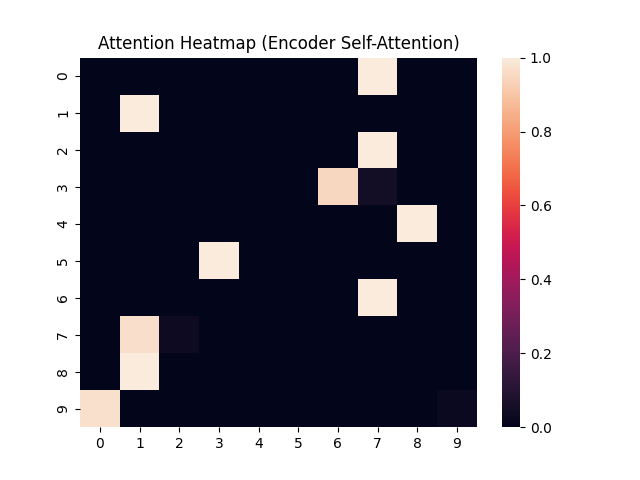

# Transformer from Scratch
Day 1 of my **Daily AI Project Challenge**: A Transformer model built from scratch in PyTorch, implementing multi-head attention, positional encoding, and encoder/decoder layers. Includes an attention heatmap visualization.

## Project Overview
This project creates a sequence-to-sequence Transformer for tasks like Q&A or translation. Tested with synthetic data, it visualizes attention weights to show token interactions in the encoder.



## Features
- **Full Implementation**: Scaled Dot-Product Attention, Multi-Head Attention, Feed-Forward Networks, Positional Encoding, Encoder/Decoder.
- **Visualization**: Attention heatmap for encoder self-attention.
- **Modular Code**: Organized in `src/models/` for reusability.
- **Tested**: Outputs `torch.Size([8, 8, 1000])` on synthetic data.

## Setup
1. Clone the repo:
   ```bash
   git clone https://github.com/RohanKamal123/DailyAIChallenge.git
   cd TransformerProject